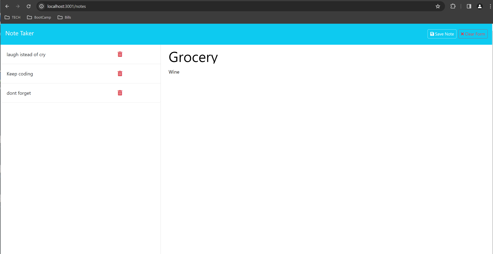

# backend-notetaker
Building the back-end for a note taker application 

# User 

I WANT to be able to write and save notes
SO THAT I can organize my thoughts and keep track of tasks I need to complete.

# Criteria 

GIVEN a note-taking application
WHEN I open the Note Taker
THEN I am presented with a landing page with a link to a notes page
WHEN I click on the link to the notes page
THEN I am presented with a page with existing notes listed in the left-hand column, plus empty fields to enter a new note title and the note’s text in the right-hand column
WHEN I enter a new note title and the note’s text
THEN a "Save Note" button and a "Clear Form" button appear in the navigation at the top of the page
WHEN I click on the Save button
THEN the new note I have entered is saved and appears in the left-hand column with the other existing notes and the buttons in the navigation disappear
WHEN I click on an existing note in the list in the left-hand column
THEN that note appears in the right-hand column and a "New Note" button appears in the navigation
WHEN I click on the "New Note" button in the navigation at the top of the page
THEN I am presented with empty fields to enter a new note title and the note’s text in the right-hand column and the button disappears

# Notes

To accomplish this project I used W3 (https://www.w3schools.com/) schools to help find the syntax of different call backs and fucntions. I also seeked help from Ask BCS and a tutor seesion with Corrado Alfano. Corrado was very helpful. Most of the tutors give you the answer straight up but Corrado helps you think and try and find the answer yourself. Very helpful. I also had to seek help in office hours because i would break my code. I accomplished the Delete call on my own however i ended up breaking it and and had to seek help to finilize the project. Interesting project. 

# Deployed Site - Heroku 

# GitHub 

https://github.com/Hannahphoto/backend-notetaker

# Screenshot

    
    

